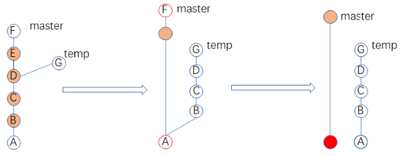
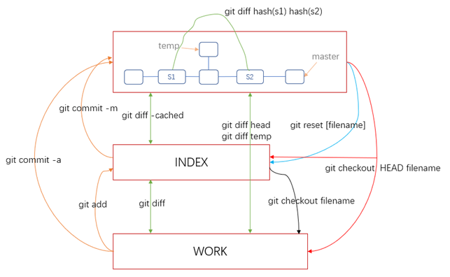

### 目录

## 一.Git基本命令

工作区(workspace) 暂存区(index) 版本库(.git repository) 远程仓库(remote) 
- [ ] **config**
    - `git config --local user.name [your_name]`
    - `git config --local user.email [your_email]`
    - `git config --local --list`
    - 优先级: local > global > system 
        - local: 区域为本仓库
        - global: 当前用户所有仓库
        - system: 本系统的所有用户
- [ ] **init add commit**
    - 新建的项目直接用git管理
    - `git init [repository_name]` 初始化git仓库
    - `cd repository_name`
    - 进行一系列开发 change the file'变更文件'
    - `git commit -am ['commit to message']` 等同于⬇️
        - git add [change_file0 change_file2 ...] 等同于 ➡️ `git add u`
            - `git add .`: 将工作空间==新增和被修改==的文件添加到暂存区
            - `git add -u`: 将==已经被git跟踪过的文件==(先前已add的)添加到暂存区(**不包含没有纳入Git管理的新增文件**)
        - git commit -m ['commit to message']
    - ==执行commit后,会建立出一个新的commit节点(HEAD).三区内容重新保持一致.==
    - ==commit的本质==:每次Git都会用暂存区的文件创建一个新的提交,把当前的分支指向新的提交节点,这样就完成了一次新的提交。
- [ ] **mv**
    - `git mv [old_fileName] [new_fileName]` 等同于⬇️
        - mv readme read
        - git add read
        - git rm readme
- [ ] **log**
    - 当前分支版本演进历史 `git log`
    - 所有分支前四次commit 单行图形化展示 (注意:不是每个分支)
        - `git log --all -n4 --online --graph`
    - 注意: 使用了--all 再指定特定分支 特定分支不会起作用
    - 查看分支所有的操作记录(包括已经删除的等): `git reflog`
    - `brew install git-gui` ; `gitk --all`
- [ ] **branch**
    - `git branch` 默认本地所有分支
    - `git branch -r` 远端所有分支
    - `git branch -a` 本地和远端所有分支
    - ==加上v参数== 会显示每个分支最后一个commit eg: `git branch -av`
    - `git brach -D [分支名称]` 删除不需要的分支
- [ ] **checkout**
    - 创建并切换本地分支 `git checkout -b [分支名称] [基于哪里'Hash值']` 等同于 ➡️
        - `git branch [分支名称] [基于哪里'Hash值']`(不写hash,默认hash是当前HEAD)
        - `git checkout [分支名称]`
        - 选定分支A的log中某一历史commit创建新分支B(俗称*拉取特性分支*),在此基础上做开发,不会影响到A
    - 切换分支 `git checkout [分支名称]` (实质上==指向此分支最新的commit==)
    - ==简单理解:== 
        - 说某某分支就指的此分支最新的commit
        - 若切换到分支的版本演进历史的某一个旧commit,会处于*分离头指针*的状态,在上面修改后做的commit,在切换回已有分支后,大概率会被Git当作垃圾处理掉！
- [ ] **tree、commit、blog**
    - 问:新建的Git仓库,有且仅有一个commit,仅包含/doc/readme,请问有多少个tree,多少个blog？
    - 答:1个commit、2个tree、1个blog
    - 解释: commit本身就是一个大文件夹,里面包含很多小文件夹和文件.
        - 一个文件夹 == 一个tree ; 一个文件 == 一个blog 
- [ ] **.git**
    - Git的本地版本库 
    - `cat ./git/HEAD` ➡️ ref:ref/heads/fix_readme
    - `cat ref:ref/heads/fix_readme` ➡️ 750db58f0
    - `cat ./git/config` 与仓库配置的相关信息(eg:name、email等)
    - 查看存放对象的类型: `git cat-file -t [master|750db58f0]` ➡️ commit 
    - 查看存放对象里的内容: `git cat-file -p [master|750db58f0]` 
    - 查看存放对象的大小: `git cat-file -s [master|750db58f0]` 
    - 一个小问题:
        - 问: git的所有数据都在.git/objects中,每次commit,git都会把当前项目做快照保存到objects目录中。那么不断commit,其objects文件夹的大小会变得很大。
        - 答: 只要任何文件的文件内容相同,那么在Git眼中它就是唯一的blog.(即==Git对相同文件只会存一个blog==!). 其次,Git还有增量存储的机制。
- [ ] **其它**
    - `git help --web log` 跳转git log的帮助文档网页
    - `git reset --hard`
    - 状态 是否追踪、有无提交: `git status`

---

## 二.独自使用Git时常用场景

- [ ] **rebase**
    - 修改最新commit的message `git commit --amend`
    - 修改以前commit的message `git rebase -i [parent_hash值]` 修改策略为**r**
    - 将连续的commit整理成一个 `git rebase -i [parent_hash值]` 修改策略为**s**
        - 在交互的策略的设定页面 依次按照策略执行 p(B)-s(C)-s(D)-s(E)-p(F) commit
    - 将不连续的commit整理成一个 `git rebase -i --root` 修改策略为s
        - 这里修改的commit是最初始的commit 参数--root
        - 依次执行策略 p(A)-s(F)-p(橙圈)
        - 不难看出,出现了两颗独立的树,因为两分支不再拥有相同ID的commit！
    - ==注意==: 某一commit发生了变化,其自身和子孙commit的ID都会发生变化。
    - 补充: 意外退出了vi界面 别慌 `git rebase --edit-todo`继续完成编辑后 `git rebase --continue`
        
- [ ] **diff**
    - 明确: HEAD通常指向当前分支最新的commit.分离头指针(detached HEAD)的情况除外.
    - 注意：
        - 在未执行`git add`指令之前,可简单理解暂存区里面存放的是HEAD指针指向的内容.执行后,暂存区里修改对应的变更的部分即可。
        - 也就是说:==刚开始 working tree、index与repository(HEAD)里面的內容都是一致的==
    - `git status` **未跟踪未提交的变更文件**
    - `git diff cached` 暂存区与HEAD的比较 **未提交变更文件的内容**
    - `git diff` 暂存区与工作区的比较 **未跟踪变更文件的内容**
    - `git diff HEAD HEAD~2`==`git diff HEAD HEAD^^`比较最近和倒数第三次的提交
    - 补充: 
        - 默认比较所有的文件 可添加多个文件名比较指定的文件
        - `git diff 47183d8 47d01ac -- index.htm` 比较不同commit指定的文件
- [ ] **reset**
    - 简单来说: reset最基本的工作就是将HEAD指向我们指定的commit！
    - 多次将工作区的同一文件添加到暂存区,会以此文件最新的变更为准
    - git reset [<mode>] [<commit>]
        - <mode> 三种形式: --mixed(默认) --hard --soft 
    - `git reset` == `git reset HEAD` ==  `git reset --mixed HEAD`
        - 工作区没影响 暂存区默认变为HEAD一样 当然可以指定恢复部分文件
    - `git reset --hard` == `git reset --hard HEAD`
        - 擦掉所有改动 工作区和暂存区默认变为HEAD一样 (版本回退到HEAD)
        - 扩展:`git reset --hard HEAD^`回退到HEAD上一个版本 HEAD～10(HEAD前第10个版本)
        - 若误操作,想撤销.挽回！
            - `git reflog`
            - `git reset --hard commit_ID` or `git cherry-pick commit_ID`
    - 注意: 新建的文件没有纳入版本管理,所以不管怎么reset,它都会在工作目录中！

指令 | 工作区working tree | 暂存区index stage | repository(HEAD)
---|---|---|--- 
git reset --mixed 47183d8| ==新增==原始HEAD节点与reset目标节点的差异| 同reset目标节点 | 同reset目标节点
git reset --hard 47183d8 | 同reset目标节点|⬅️|⬅️
git reset --soft 47183d8 | 没影响|==新增==原始HEAD节点与reset目标节点的差异|同reset目标节点
- [ ] **checkout**
    - 将工作区的某文件恢复成暂存区的一样 `git checkout [fileName]`
    - 回退最后一次提交内容(HEAD覆盖暂存区和工作区对应文件) `git checkout HEAD [fileName]`
    - 最简单的用法 查看工作区、暂存区与HEAD的差异: `git checkout` 等同于 `git checkout HEAD` ➡️ M f1(表明对f1文件进行了修改)
- [ ] **rm**
    - 在工作区,直接使用`rm [fileName]`(同Linux操作)
    - 若文件已经提交版本库
        - `git rm [file_name]` 
        - `git commit -m "remove file_name"`
    - 若删除错了,使用`git checkout [filename]`进行恢复
- [ ] **stash**
    - 注意!: 在某一分支上创建的空文件夹、空文件或添加有内容的文件会出现在其它分支上(git status不会理会空文件夹)
        - 在该分支未执行commit指令(**哪怕当前已经执行了add指令**)之前都是可以checkout随意切换分支的;
        - 执行commit指令后,文件夹或文件会纳入当前分支的代码库管理,在其它分支不再会出现。
        - 综上: 新建的文件没有纳入版本管理，所以会被带到切换的分支,因而在切换分支前,最好commit一下.
    - `git stash`;`git stash save ['save_message']`
        - 对当前分支的修改内容进行存储 -> 所有未提交的修改(工作区和暂存区)保存至堆栈(先进后出)中
    - `git stash list` 查看当前stash中的内容
    - `git stash pop`;`git stash pop stash@{0}`
        - 将当前stash中的内容弹出，并应用到当前分支对应的工作目录上
        - 也就是说,stash中的内容不仅仅可以恢复到原先开发的分支，也可以恢复到其他任意指定的分支上
    - `git stash apply`;`git stash apply stash@{0}`
        - 不同于pop,它不会将内容从堆栈中删除! 
    - `git stash drop stash@{0}` 从堆栈中移除某个指定的stash
    - `git stash clear` 清除堆栈中的所有内容
    - `git stash show stash@{1} -p`
        - 查看指定的stash和当前目录差异 -p详细有哪些不同
    - `git stash branch ['new_branch_name']`
        - 修改某一文件,stash后再修改,stash pop,会有冲突 ➡️ 可通过创建新的分支来解决冲突！
- [ ] **.gitignore**
    - 指定不需要GIT管理的文件,举几个栗子:
        - `*.d` 以.d结尾的文件 ✖️
        - `*.dSYM/`
            - 若有一个名为a.dSYM文件 ☑️
            - 若有名为*.dSYM的文件夹,文件夹及文件夹下的任何文件 ✖️
        - doc 不管是文件还是文件夹 ✖️
- [ ] **tag**
    - 详见官方文档:`https://git-scm.com/book/zh/v2/Git-%E5%9F%BA%E7%A1%80-%E6%89%93%E6%A0%87%E7%AD%BE` 
    - 添加标签
        - 指定分支历史commit `git tag -a v1.0 47183d8 -m "my version 1.0"`
        - 当前分支最新commit `git tag -a v1.0`
        - 远程仓库添加标签 
            - `git push origin v1.0`
            - `git push origin --tags`(推送本地所有标签至远端)
    - 查看标签
        - 有哪些标签 `git tag --list`;
        - 标签具体内容 `git show v1.0`
    - 删除标签
        - 删除本地标签(并不会在任何远程仓库中移除) `git tag -d <tagname>`
        - 删除远程标签 `git push origin --delete <tagname>`
    - 注意!:`git reset --hard v1.0`
    - 可以在github上创建 Release给标签添加具体的说明！！
- [ ] **三区转换** ⭐️:
    - 当index暂存区为空时: 
        - `git checkout HEAD filename` == `git checkout filename`     
        - `git diff` == `git diff HEAD`
        - 
---

